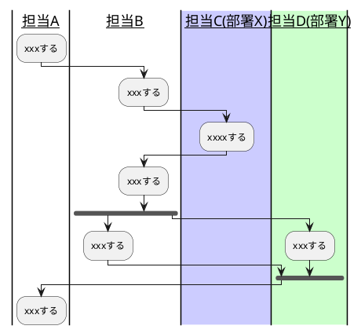
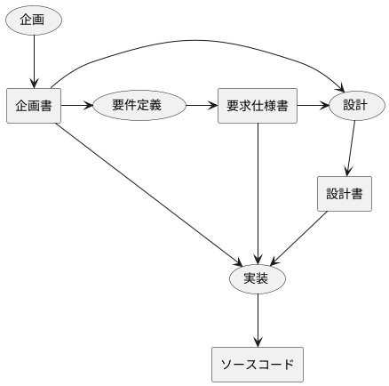
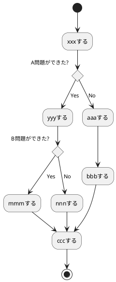

# paper
論文の翻訳

|案|メリット|デメリット|決定|
|:--|:--|:--|:--|
|案A:xxxする| | | |
|案B:xxxする| | | |
|案C:xxxする| | | |

## xxxx会議録
日時:2018/10/xx
場所:xxx会議室
出席者:xxx,xxx,xxx,xxx

### 1.目的
* xxxxの対応を決める。
* xxxxの対応を決める。

### 2.結論
* xxxxをxxxとする。
* xxxxをxxxとする。

### 3.A.I.
* xxxxxする。(担当: xxx 期日： x/xまで)
* xxxxxする。(担当: xxx 期日： x/xまで)
* xxxxxする。(担当: xxx 期日： x/xまで)

### 4.議論
* xxxxはxxxではないか？(Aさん)
→ xxxにする。

__xxxのワークフロー__


__開発プロセス(PFD)__


```
__\```plantuml__
@startuml
|__担当A__|
:xxxする;
|__担当B__|
:xxxする;
|#ccf|__担当C(部署X)__|
:xxxxする;
|__担当B__|
:xxxする;
fork
|__担当B__|
:xxxする;
forkagain
|#cfc|__担当D(部署Y)__|
:xxxする;
end fork
|__担当A__|
:xxxする;
@enduml
__\```__
```

__PDPC__


```plantuml
@startuml
actor A

node "社内"{
    A -up-> [xxxサーバー] : アクセス
}

node "AWS"{
    database DB
    [xxxサーバー]-right->[xxxAPI] : hoge
    [xxxAPI]-right->DB : xxxする   
}
@enduml
```

