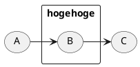
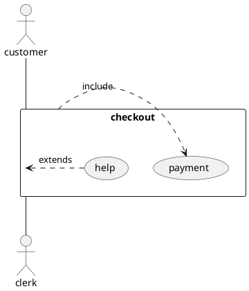

## ベイズの考え方のまとめ

__「あえて確率的な問題設定を行い，変数の確率分布を求める手順を経ること」__ が確率モデリングでの基本的な態度。

## いろいろな確率の書き方

### 同時確率

ｘ，ｙが同時に起きる確率。p(x,y)と書く。

### 条件付き確率

xが起きたときにyが起きる確率 p(y|x)と書く。

## ベイズの定理

いろいろな考え方の基礎となるのがベイズの定理。最初は適当でも良いので、事前確率を仮定し、事後確率を求める。そして得られた事後確率を、事前確率として再び事後確率を求めるという作業（ベイズ更新）を繰り返すことで、最終的な近似確率が得られる。発見的に作業を進められ、応用がとても広い。

一般にθをパラメータ（環境、求めたい仕組み）、Dを観測データとして記号が使われる。

p(θ)：事前確率
p(θ|D):事後確率
p(Θ,D)：同時確率
p(D|Θ):尤度（仮説のもとで起きる確率）

p(θ|D) = p(D|Θ)*p(θ)/p(Θ,D)

このように事後確率まで求めたあとで、その次のデータを予測することもある。

p(D次)=p()

## ベイズで解くことができる例

* ある単語が含まれているときのスパムメールである確率
* 

## 分布



## グラフィカル・モデル

### DAG(directed acylic graph)

|項目|描き方|
|:--|:--|
|

2.12 Complete example2 USE CASE DIAGRAM2.12 Complete example

@endumlPlantUML Language Reference Guide (Version 1.2018.2)30 of121
