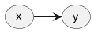
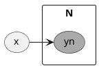
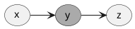
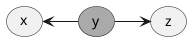
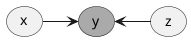
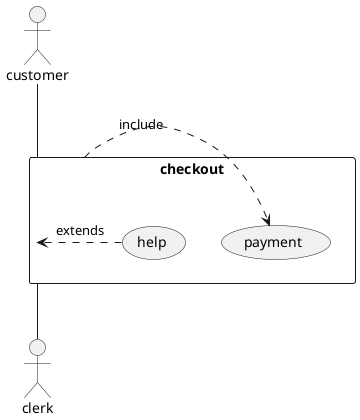

# 機械学習における確率学習の道しるべ

確率の学習では、__「あえて確率的な問題設定を行い，変数の確率分布を求める手順を経る」__ という独特な発想法を獲得しなければなりません。初学の理解するまでの道しるべ。

## まずは表記方法になれる。

まずは記号になれておかないと、そこで引っかかって読めなくなります。

|記号|意味|
|:--|:--|
\(X\) : 集合
\(x\):確率変数
\(p(x)\):確率分布
\(p(x,y)\):同時分布
\(p(y|x)\):条件付き分布

## いろいろな確率

### 同時確率

\(x,y\)が同時に起きる確率。\(p(x,y)\)と書く。

\(x\)を性別、\(y\)を趣味とする。
\( p(x='man',y='reading') \) のようになる。

### 条件付き確率

\(x\)が起きたときに\(y\)が起きる確率 \(p(y|x)\)と書く。
風が吹いたときの桶屋が儲かる確率は、
\(p(y='furoya'|x='kaze')\)

## 確率の計算の基本

### 加法定理（周辺化）

複数の変数があるときに、一つの観点で足し上げる操作。
積分や足し上げて変数を消す操作。

\[p(x)=\sum_{y}p(x,y)\]

### 乗法定理

同時確率を条件付きに変換する。

\[p(x,y)=p(x|y)p(y)\]

### ベイズの定理

いろいろな考え方の基礎となるのがベイズの定理。最初は適当でも良いので、事前確率を仮定し、事後確率を求める。そして得られた事後確率を、事前確率として再び事後確率を求めるという作業（ベイズ更新）を繰り返すことで、最終的な近似確率が得られる。発見的に作業を進められ、応用がとても広い。

一般にθをパラメータ（環境、求めたい仕組み）、Dを観測データとして記号が使われる。

\(p(θ)\)：事前確率
\(p(θ|D)\):事後確率
\(p(θ,D)\)：同時確率
\(p(D|θ)\):尤度（仮説、環境のもとで起きる確率）

\[p(θ|D)=\frac{p(D|θ)p(θ)}{p(θ|D)}\]

このように事後確率まで求めたあとで、その次のデータを予測することもある。

\[p(Dnext=)\]

## ベイズで解くことができる例

* ある単語が含まれているときのスパムメールである確率

p(いやらしい言葉,スパムメール)、p(お金儲け言葉,スパムメール)
p(美容の言葉,スパムメール)、p(健康の言葉,スパムメール)のように以下のようにベイズの定理からp(スパムメール|何かの言葉)を求めることができる。

p(スパムメール|何かの言葉) = p(何かの言葉|スパムメール)*p(何かの言葉)/p(スパムメール,何かの言葉)

## 確率分布

確率の分布、連続的な場合と、非連続な場合

### 共役分布(覚えたい分布の種類)

ベイズの定理で事前事後分布の形が変わらないと計算を簡単にすすめることができる。問題の形式によって事前分布が選ばれる。

## グラフィカル・モデル

### DAG(directed acylic graph)

__条件付き確率__

\(p(x,y)=p(y|x)p(x)\)

条件付き確率\(p(y|x)\)のような関係のとき以下のように描く。

観測されたデータを着色して考える。
観測されたデータは、分布を持たず、白丸だけの分布を考えれば良くなる。

```plantuml
@startuml
(x)
(y)  #AAAAAA
(x)->(y)

@enduml
```

__プレート表現(変数がN個ある場合)__

変数がn個ある場合、プレート表現を使う。

## グラフの型

__head to tail型__

3つの変数が順序関係にあるとき、同時確率とグラフィカルモデルは以下のようにかける。

\[p(x,y,z) = p(y|z)p(y|x)p(x)\]

__tail to tail型__

\[p(x,z|y)=\frac{p(x,y,z)}{p(y)}\]
\[=\frac{p(x|y)p(z|y)p(y)}{p(y)}\]
\[=p(x|y)p(z|y)p(y)\]

yが観測できれば比較的容易。

__head to head型__

\[p(x,z)=\sum_{y} p(x,y,z)\]
\[=\sum_{y} p(y|x,z)p(x)p(z)\]
\[=p(x)p(z)p(y|x,z)p(x)p(z)\]

## KLダイバージェンス

## 変分推論

## ELBO

## Flow

## Glow
