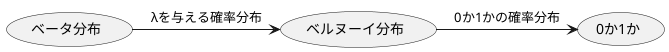
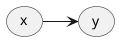
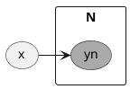
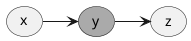
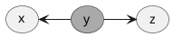
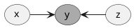
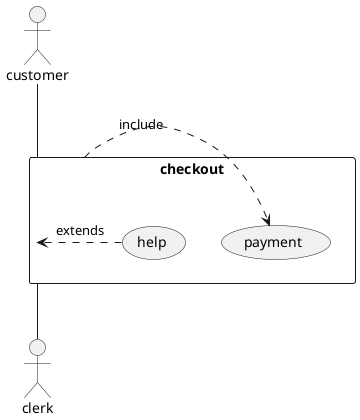

# 積ん読者のための超簡単！確率入門

# Step 0.はじめに

この本は機械学習や確率の本を何冊か買っては見たけれど。。。という読者（自分も含め）を対象にしています。確率を使った機械学習を行うには、__「あえて確率的な問題設定を行い，変数の確率分布を求める手順を経る」__ という独特な考え方を獲得するまでの長い旅路になります。

教科書の数式をすべて厳密に理解することも大事ですが、それでは数ページで疲れ果ててしまいます。今から何を目指していくのか、何を知るための準備をしているのか、その大きな流れを知っているのと、いないのでは理解の速さも違ってくると思います。本書のポイントは、その流れを補助することで、皆さんの手元にある教科書を理解するにあたっての、大きな流れを書くことです。

この単元では何を抑えようとしているのだろう？それが何につながるのだろう。そのつまづきを支援するために、書きました。さあ、皆さんの教科書を手元にありますか？では、はじめましょう！

# Step1. いろいろな確率を知ろう!

まずは確率にもいろいろな書き表し方があることを知りましょう。
皆が話す言葉を決めておくことはとても大事ですね。

## 1.1.単純な確率

\(x\)が\(a\)となるときの確率を\(p(x=a)\)と書きます。このときの「\(x\)が〜」の\(x\)を確率変数といいます。厳密には\(x=a,b,c...\)となるので、色々とりうる値も含め、その分布状態を単なるxの確率を\(p(x)\)と書きます。

## 1.2.同時確率

\(x\)が起きる確率を考えましたが、\(x,y\)が同時に起きる場合というのがあります。これを同時確率と呼び、\(p(x,y)\)と書きます。たとえば\(x\)を性別、\(y\)を趣味としたときに、男性で読書が趣味の場合は\( p(x='man',y='reading') \) のようになりますね。

## 1.3.条件付き確率

つぎに\(x\)が起きたときに\(y\)が起きる確率、条件つき確率です。\(x\)が起きたときに\(y\)の確率は \(p(y|x)\)と書きます。条件が後ろ側です。たとえば、風が吹いたときの桶屋が儲かる確率は\(p(y='okeya'|x='kaze')\)のように書くことができます。

# Step2.確率計算の基本を覚えよう！

次に、これらの確率の代表的な計算方法を理解しましょう。実はそれほどパターンが有るわけではありません。以下の３つを覚えておきましょう。

### 加法定理（周辺化）

周辺化はとても重要な操作で、同時確率で複数ある確率変数の、どれかで足し上げる操作です。\(\sum\)や積分によって足し上げて、足し上げた確率変数を消す操作といえます。

__離散の場合(yをN回足しあげる)__
\[p(x)=\sum_{y=1}^{N}p(x,y)=p(x,y_{1})+p(x,y_{2})+...+p(x,y_{N})\]

たとえば、

__連続の場合(yについて積分する)__
\[p(x)=\int p(x,y)dy\]

確率変数\(y\)が連続値の場合、1,2,....Nと数え上げることができませんので、積分による操作となります。いずれにせよ、周辺化を行うと、右辺の変数\(y\)が左辺では消えていることに気がつくと思います。

### 乗法定理

同時確率を条件付き確率で計算（変換）することができます。

\[p(x,y)=p(x|y)p(y)\]

または条件付き確率を、同時確率で計算することができます。

\[p(x|y)=\frac{p(x,y)}{p(y)}\]

### ベイズの定理

そして、重要なのがベイズの定理です。
乗法定理をくっつつけると

\[p(x,y)=p(y|x)p(x)=p(x|y)p(y)\]

となり、以下の形式で書くことができます。最後の分母は周辺化でしたね。

\[p(y|x)=\frac{p(x|y)p(y)}{p(x)}=\frac{p(x|y)p(y)}{\int p(x,y)dy}\]

### Point!

確率の計算、操作の仕方を学びました。
周辺化（加法定理）による確率変数消去、乗法定理の同時確率⇔条件つき確率変換、ベイズの定理（乗法定理を連結）の３つのパターンをしっかり覚えておきましょう。

## ベイズの定理に意味を与えよう！

さきほどの節では、ベイズの定理を確率の計算として触れました。単なる\(x\)と\(y\)ということで無味乾燥な式でした。それでは詰まらないですよね？ベイズの定理の意味を考えてみましょう。まずは\(x,y\)を\(D,w\)とに置き換えてみましょう。

すると

\[p(w|D)=\frac{p(D|w)p(w)}{p(D)}=\frac{p(D|w)p(w)}{\int p(D,w)dw}\]

となります。ここで\(D,w\)の種明かしをすると、\(D\)は観測されたデータ、\(w\)は世界(World)です。
左辺の、\(p(w|D)\)の条件付き確率に注目してください。
__あるデータ\(D\)になった場合、つまりはあるデータ\(D\)を手に入れたとき、\(w\)つまりは世界の状態が、どうなるかを問う式となっています。__ なんと単純で、壮大で、野心的な試みといえる式なのでしょうか。 あなたは世界を予測する式を手に入れたと言えるのです。

それではベイズの定理の意味がわかったところで、早速、ベイズの定理に登場する、世界を予測する式の登場人物を見てみましょう。

まずは左辺の

* \(p(w|D)\):事後確率、データがわかったときの世界の状態の予測

です。これを事後確率と呼びます。では、事後ということは、その前は何でしょうか？
それが、右辺の

* \(p(w)\)：事前確率

です。ここは世界の仮定です。wのとりうる値は、それぞれどんな確率で起きるかな？、という仮定です。式の流れとしては事前確率から事後確率がわかる。それによって世界を更に良く推定する。それがベイズの定理の力です。

残りの項を見ていきましょう。l

* \(p(D|w)\):尤度

こちらは尤度といいます。データが出てくる可能性です。
分母の部分はエビデンスといいます。

* \(\int p(w,D)dw\)：エビデンス

エビデンスは複雑な式ですね。エビデンスを求めることは計算量が多くなります。ただ、エビデンスは確率全体を1にする係数となりますので、ある、\(w=1,w=2\)どっちの確率が多いの少ないの？という議論に影響しないということです。ですので、計算自体を行わないようにする工夫が用いられます。

### Point!
* ベイズの定理はデータから世界を予測する意味がある。
* 事前分布を与え、事後分布を導き出そう。

## 確率を使った表現、確率分布を知ろう

さて、これから具体的に確率を扱っていきます。

### 確率の分布を表す関数

確率の種類や確率の計算の仕方の次は、その計算対象となる確率がどのような分布をしているかを考えます。というのも確率の分布は計算に大きな影響を与えるからです。計算が難しいものは近似的に計算するなどしないといけません。とはいえ、まずは

#### 確率密度関数、確率質量関数

確率変数がある値を取る確率を関数で書き表すことができます。
たとえば、1から6の目がでるサイコロの目は、

\[Pr(x=1)=Pr(x=2)=Pr(x=3)=...=Pr(x=6)=\frac{1}{6}\]

と書くことができますね？サイコロは1〜6までの離散値を取りますので、この関数を確率質量関数といいます。一方でサイコロではなく温度計のような連続的な値を取る場合にも、同様な関数を考えることができますが、その場合、確率密度関数と呼びます。

このような言葉を理解した上で、様々な問題について確率の分布を考えてみましょう。
__ここでは、どの問題にどの分布を使うか、そして、その分布に共役な分布があることを覚えていきます。__

### コインの裏表、0か1かの問題

たとえば、コインの表=1が出る確率を\(λ\)とすると、裏が出る確率は、確率は合計1なので\(1-λ\)と書くことができます。このような確率の分布の仕方を __ベルヌーイ分布__ と呼びます。ベルヌーイ分布の確率は以下のように書くことができます。

\(Pr(x=1)=λ, Pr(x=0)=1-λ\)

あくまで上の2値を同時に書き下すようにすると、

\(Pr(x)=λ^{x}(1-λ)^{1-x}\)

というように書けます。

覚えましたね？__コインのような問題の確率の分布は、ベルヌーイ分布__ です。

そして、ベルヌーイ分布のλというパラメータについて考えてみましょう。λは何らかの確率の結果出てきた値で、λを確率変数とすると更に何かの確率分布によって作られたと考えることもできます。その確率分布が __ベータ分布__ です。__ベータ分布は0〜1までの値を取る確率変数 \(λ\)に対する確率分布__ です。

つまり、0か1かというコインのどちらがでるかという問題に対して、確率分布を表すのがベルヌーイ分布です。そのベルヌーイ分布のパラメータである種のメタの立場にあるパラメータが\(λ\)です。そして、ベータ分布は、そのλの確率分布を表します。そのメタの立場にあると言って良いのかもしれません。

### サイコロの目

次にサイコロの目のような場合の確率分布を考えてみましょう。\(N\)個の出目に対して、それぞれ確率がある場合ですね。この場合は、 __カテゴリカル分布__ 相当します。カテゴリカル分布でも、先程のベルヌーイ分布(問題を表現する確率分布)とベータ分布(ベルヌーイ分布のパラメータ λを確率的に生み出す)のように、カテゴリカル分布を生成させる確率分布が存在します。それは __ディリクレ分布__ です。

### 山のある分布(正規分布)

連続量に対する、もっとも綺麗な山の分布。有名な正規分布ですね。正規分布の場合、平均\(μ\) 、分散\(σ^{2}\)で山の形が決まります。平均は山のピークがどこにあるのか、分散は山の裾野の広がりです。この２つのパラメータを生成するのは、逆ガンマ分布です。

（教科書を見ると、他にも二項分布、多項分布というのも出てくると思います。これはベルヌーイ分布やカテゴリカル分布の延長です。何回かサイコロを振るような問題に使います。）

### 共役分布

先ほどでた、問題の確率分布に対して、それを生成する分布がありました。
これを共役分布といいます。共役分布の特徴は、問題の分布と掛け算の結果が共役分布になることです。つまり、ベルヌーイ分布と、その共役分布であるベータ分布を掛け算すると、ベータ分布となります。

### Point!

|ケース|使用する確率分布|共役分布|
|:--|:--|:--|
|コインの裏表、0か1か|ベルヌーイ分布|ベータ分布|
|サイコロの目のような、出目がある場合|カテゴリカル分布|ディリクレ分布|
|山のある分布を確率的に表現したい、確率変数が一つ|正規分布|逆ガンマ分布|

## 学習の枠組みを理解する（回帰、分類）

世界を予測する式を手に入れたということ、問題をどう分布で表現するかを学びました。
は観測されたデータ、
機械学習とは、データを与えるとなにか結果を出す関数\(f\)を、より適切になるように手元のデータを使って考えるということです。

まずは学習を大きく分類してみましょう。一つは世界は連続的な数値を推定する場合、もう一つは離散的な場合です。
たとえば、ゴミの画像を見て、そのゴミの大きさや重さを類推する場合、連続量を出力にします。
これは回帰と呼ばれます。

|推定したい量|名称|
|:--|:--|
|カテゴリ|分類|
|数値（連続量）|回帰|

一方でなにのゴミに捨てるのかは、幾つかの分別先に分けて、

## 学習の枠組みを理解する（識別モデル、生成モデル）

学習タスクとしては、
次に学習のアプローチに２つあることがわかります。
一つは識別モデルです。

事前分布

Pr(w|D)=Pr(D|w)P(w)

|学習モデル|方法|
|:--|:--|
||P(D)を計算|
|||

また、もう一つは。

## 推定の考え方

では、具体的な推定方法を考えてみましょう。

### 最尤推定

問題の条件を満たす確率を求める方法です。
これは確率を最大化するパラメータを求めることで考えます。

\[\underset{θ}{\mathrm{argmax}} P(x|θ)\]

たとえばプロ野球チームの実力で勝てる値を\(θ\)と考えてみましょう。

開幕2勝1敗でスタートした時点での、チームの勝率\(θ\)を最尤推定してみましょう。
2勝1敗の確率は\(θ^{2}(1-θ)\)ですので、この最大となる\(θ\)を推定すればよくなります。

最大値のところでは微分値が\(0\)となるはずですので\(2θ-3θ^{2}=θ(2-3θ)=0\)つまりは\(θ=2/3\)が最大値をとるところですね。

最尤推定は、欠点はピンポイントの点を計算をします。極端に振れてしまうことがあります。
たとえば、3連勝で考えると、本当に3連勝するチームは、ずっと連勝続けるでしょうか？
あまり、実力を反映しているとは思えないのですが、それが最尤推定でおきてしまうことです。

### MAP推定

MAPとはMaximise a posteriorでa posteriorで事後分布のことです。
つまり、MAP推定は事後分布で考える方法です。最初に事前分布を仮定して、事後分布を求めます。データが幾つかあるので、それらを使って更新しましょう。

まず最初の事前分布ですが、チームの実力を\(θ\)=0.5と考えてみましょう。

\[P(w|D)=\frac{P(D|w)P(w)}{P(D)}=\frac{P(D|w)P(w)}{P(D)}=\]

\[\underset{θ}{\mathrm{argmax}} P(θ|x)=\underset{θ}{\mathrm{argmax}} P(x|θ)P(θ)\]

P(D)=P(D|w)P(w)0,1

### ベイズ推定

ベイズ推定は、最尤推定やMAP推定が点で推定を行ったのに対して、

\[p(θ|D)=\frac{p(D|θ)p(θ)}{p(θ,D)}\]

識別モデルのとき。
* P(w)の適切なタイプを選ぶ：正規分布
* そのモデルがxとθでかけること。

生成モデルのとき
* P(x)についての適切なモデルを選ぶ。
* それをwとθで書く。

モデル：xとwをむすびつける数式
 P(w|x)をモデル化する。識別モデル。
 P(x|w)をモデル化する。生成モデル。

学習：

生成モデルのときは、xの生成されることを推定。

## ベイズで解くことができる例

* ある単語が含まれているときのスパムメールである確率

p(いやらしい言葉,スパムメール)、p(お金儲け言葉,スパムメール)
p(美容の言葉,スパムメール)、p(健康の言葉,スパムメール)のように以下のようにベイズの定理からp(スパムメール|何かの言葉)を求めることができる。

p(スパムメール|何かの言葉) = p(何かの言葉|スパムメール)*p(何かの言葉)/p(スパムメール,何かの言葉)

## 確率分布

確率の分布、連続的な場合と、非連続な場合

### 共役分布(覚えたい分布の種類)

ベイズの定理で事前事後分布の形が変わらないと計算を簡単にすすめることができる。問題の形式によって事前分布が選ばれる。

## グラフィカル・モデル

### DAG(directed acylic graph)

__条件付き確率__

\(p(x,y)=p(y|x)p(x)\)

条件付き確率\(p(y|x)\)のような関係のとき以下のように描く。

観測されたデータを着色して考える。
観測されたデータは、分布を持たず、白丸だけの分布を考えれば良くなる。

```plantuml
@startuml
(x)
(y)  #AAAAAA
(x)->(y)

@enduml
```

__プレート表現(変数がN個ある場合)__

変数がn個ある場合、プレート表現を使う。

## グラフの型

__head to tail型__

3つの変数が順序関係にあるとき、同時確率とグラフィカルモデルは以下のようにかける。

\[p(x,y,z) = p(y|z)p(y|x)p(x)\]

__tail to tail型__

\[p(x,z|y)=\frac{p(x,y,z)}{p(y)}\]
\[=\frac{p(x|y)p(z|y)p(y)}{p(y)}\]
\[=p(x|y)p(z|y)p(y)\]

yが観測できれば比較的容易。

__head to head型__

\[p(x,z)=\sum_{y} p(x,y,z)\]
\[=\sum_{y} p(y|x,z)p(x)p(z)\]
\[=p(x)p(z)p(y|x,z)p(x)p(z)\]

## 変分推論

##  MCMC

## ELBO
## KLダイバージェンス

## Flow

## Glow
